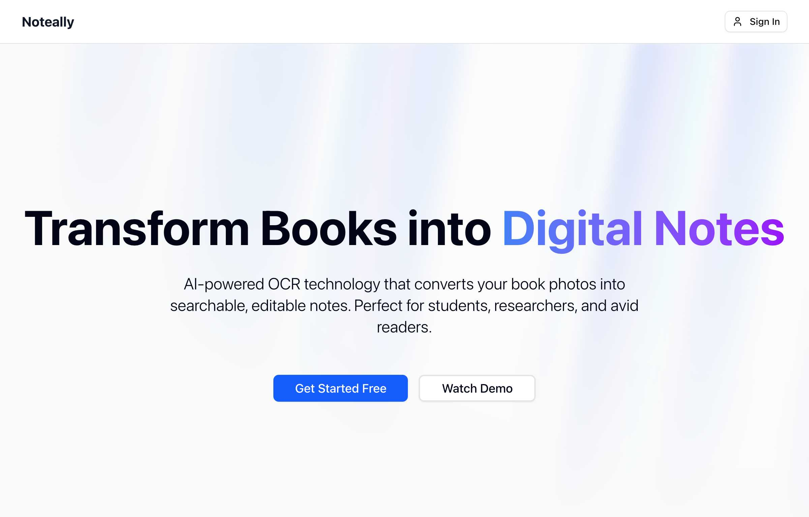
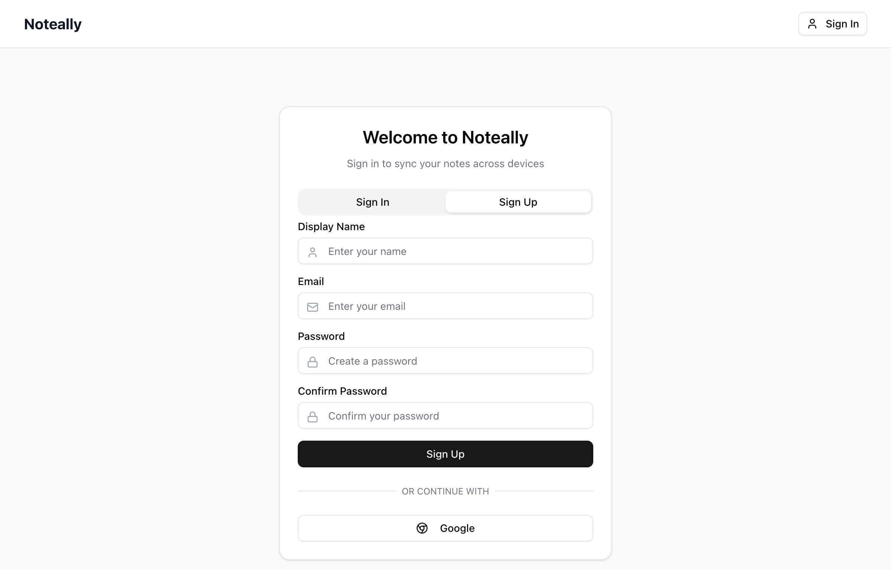
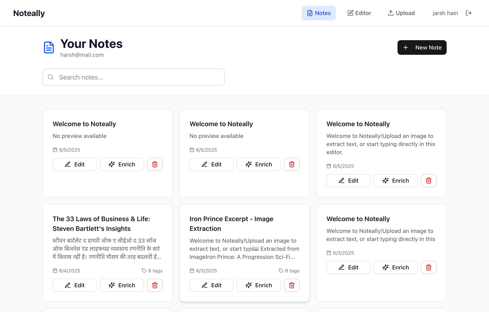
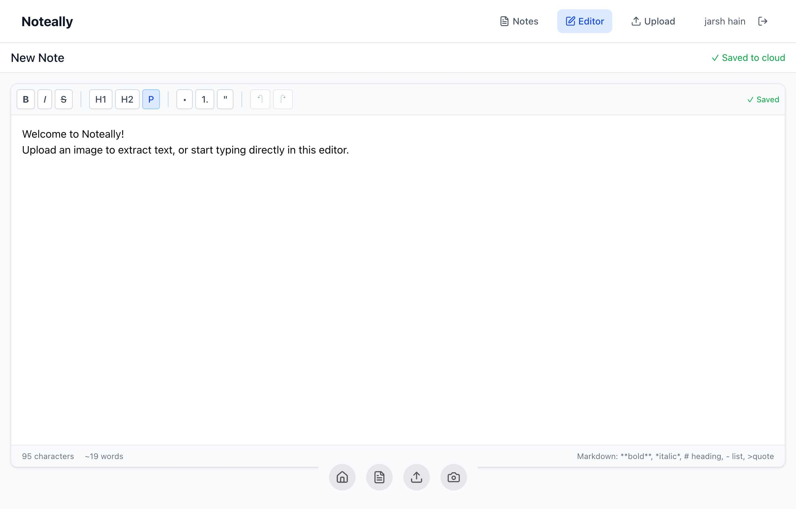
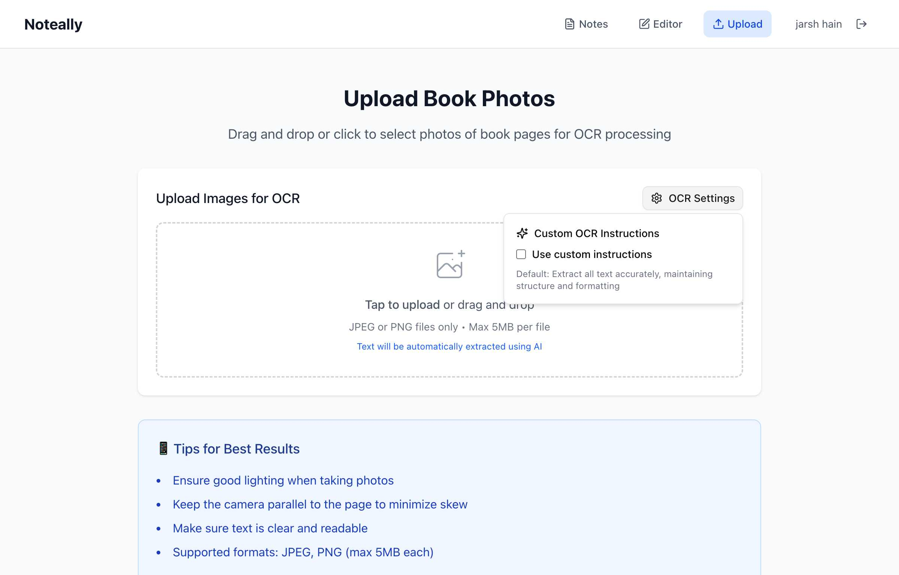

# Noteally - AI-Powered Photo Notes

> Transform your physical books into searchable, digital notes with the power of AI

Noteally is a minimalist, photo-based notepad web application designed for students, researchers, and avid readers. It leverages Google's Gemini AI to extract and process text from photos of book pages, enabling you to quickly create searchable, editable, and organized digital notes from physical sources.

## ✨ Features

- 🤖 **AI-Powered Text Extraction**: Using Google Gemini's advanced language models with 90%+ accuracy
- 📷 **Real-Time Camera Capture**: Direct webcam integration for immediate photo taking
- ✏️ **Editor-First Design**: Full-screen rich text editor with advanced formatting
- 🎯 **Intuitive Dock Interface**: Apple-style dock with smooth animations and quick access tools
- 🔍 **Powerful Search & Organization**: Lightning-fast search with smart tagging and categories
- 🌐 **Cross-Device Sync**: Access notes anywhere with real-time synchronization
- 📱 **Mobile Optimized**: Full-featured experience on all devices

## 📸 Product Showcase


🌟 **Beautiful Landing Page**: Clean design showcasing AI-powered OCR technology for students, researchers, and book lovers


🔐 **Simple Authentication**: Quick sign-up with email/password or Google integration for seamless onboarding


📚 **Smart Dashboard**: Organized note management with search, tags, previews, and quick actions


✏️ **Rich Markdown Editor**: Full-featured editor with live markdown support and formatting toolbar


🤖 **Smart OCR Upload**: Advanced image upload with custom AI instructions for precise text extraction

### 🎯 Key Workflow Features

- **📖 Smart Text Extraction**: Upload book photos with custom OCR instructions
- **⚡ Live Markdown Rendering**: Type `**bold**`, `*italic*`, `# headings` for instant formatting  
- **🔍 Intelligent Search**: Find any content across your entire digital library
- **🏷️ Auto-Tagging**: AI-powered categorization and smart organization
- **☁️ Real-time Sync**: Access your notes from any device, anywhere

## 🚀 Quick Start

### Prerequisites
- Node.js 18+ and npm
- Firebase project with Firestore and Authentication enabled
- Google AI API key for Gemini

### Installation

1. **Clone and install**
   ```bash
   git clone https://github.com/your-username/noteally.git
   cd noteally
   npm install
   ```

2. **Environment setup**
   Create `.env.local` with your credentials:
   ```env
   # Firebase Configuration
   NEXT_PUBLIC_FIREBASE_API_KEY=your_api_key
   NEXT_PUBLIC_FIREBASE_AUTH_DOMAIN=your_project.firebaseapp.com
   NEXT_PUBLIC_FIREBASE_PROJECT_ID=your_project_id
   NEXT_PUBLIC_FIREBASE_STORAGE_BUCKET=your_project.appspot.com
   NEXT_PUBLIC_FIREBASE_MESSAGING_SENDER_ID=your_sender_id
   NEXT_PUBLIC_FIREBASE_APP_ID=your_app_id
   NEXT_PUBLIC_FIREBASE_MEASUREMENT_ID=your_measurement_id

   # Google AI Configuration
   GOOGLE_AI_API_KEY=your_gemini_api_key
   ```

3. **Firebase setup**
   ```bash
   npm install -g firebase-tools
   firebase login
   firebase init firestore
   firebase deploy --only firestore:rules
   ```

4. **Start development**
   ```bash
   npm run dev
   ```

   Open [http://localhost:3000](http://localhost:3000) to see your app.

## 🏗️ Tech Stack

- **Frontend**: Next.js 14+ with App Router, Shadcn UI, Tailwind CSS, Framer Motion
- **Backend & AI**: Firebase Firestore, Firebase Auth, Google Gemini API via Genkit
- **State Management**: Zustand for lightweight, scalable state handling
- **Deployment**: Vercel for hosting, Firebase for backend services

## 📁 Project Structure

```
noteally/
├── src/
│   ├── app/                    # Next.js App Router
│   ├── components/
│   │   ├── ui/                # Shadcn UI components
│   │   ├── editor/            # Rich text editor
│   │   ├── dock/              # Dock interface
│   │   └── notes/             # Note management
│   ├── lib/                   # Firebase, Gemini AI integration
│   ├── hooks/                 # Custom React hooks
│   └── types/                 # TypeScript definitions
├── docs/screenshots/          # Product showcase images
├── firestore.rules           # Database security rules
└── firebase.json             # Firebase configuration
```

## 🔐 Security

- **User Isolation**: Firestore security rules ensure users can only access their own notes
- **Encrypted Transit**: All data transmission uses HTTPS/TLS encryption
- **Anonymous Auth**: Quick setup without requiring personal information
- **Local Processing**: Images are processed securely without permanent server storage

## 🎯 Usage

1. **Sign In**: Use anonymous authentication for quick access
2. **Capture**: Click the camera icon in the dock to take a photo of text
3. **Extract**: Watch as AI automatically extracts text from your image
4. **Edit**: Use the rich text editor to refine and format your notes
5. **Organize**: Add tags and categories to keep your notes structured
6. **Search**: Find any note instantly using the powerful search feature

## 🚀 Deployment

### Production Build
```bash
npm run build
npm start
```

### Deploy to Vercel
```bash
npx vercel --prod
```

### Deploy Firebase Rules
```bash
firebase deploy --only firestore:rules,firestore:indexes
```

## 🔧 Development

```bash
npm run dev          # Start development server
npm run build        # Build for production
npm run lint         # Run ESLint
npm run type-check   # Run TypeScript compiler
```

## 🐛 Troubleshooting

**Camera not working?** Check browser permissions and ensure HTTPS  
**Text extraction not accurate?** Ensure good lighting and focus  
**Notes not saving?** Check Firebase configuration and internet connection  
**Authentication issues?** Verify environment variables and Firebase settings

## 🤝 Contributing

1. Fork the repository
2. Create a feature branch: `git checkout -b feature/amazing-feature`
3. Commit changes: `git commit -m 'feat: add amazing feature'`
4. Push to branch: `git push origin feature/amazing-feature`
5. Open a Pull Request

## 📄 License

MIT License - see [LICENSE](LICENSE) for details.

---

**Made with ❤️ by the Noteally team**

*Transform your reading experience with AI-powered note-taking*
